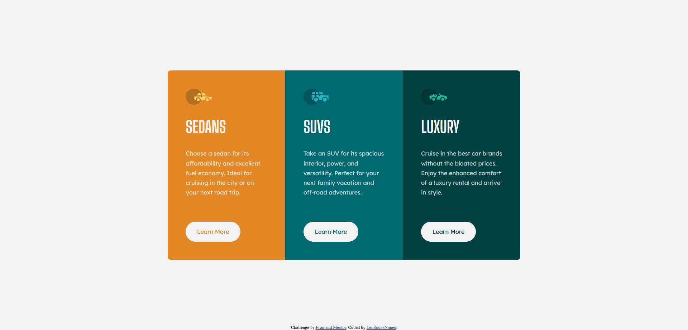
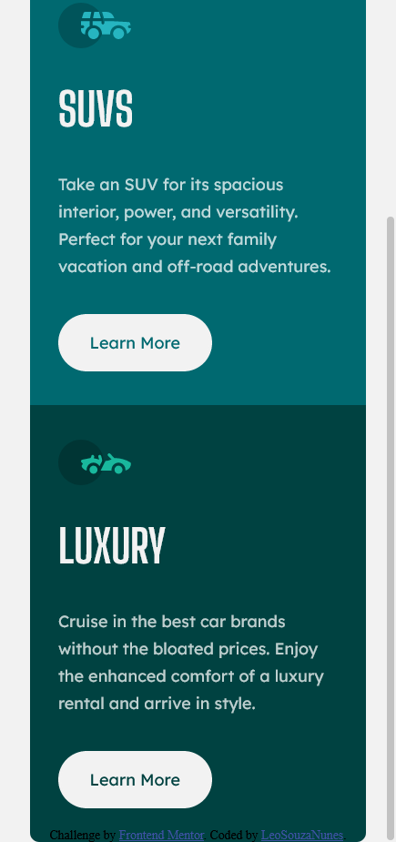

# Frontend Mentor - 3-column preview card component solution

This is a solution to the [3-column preview card component challenge on Frontend Mentor](https://www.frontendmentor.io/challenges/3column-preview-card-component-pH92eAR2-). Frontend Mentor challenges help you improve your coding skills by building realistic projects. 

## Table of contents

- [Overview](#overview)
  - [The challenge](#the-challenge)
  - [Screenshot](#screenshot)
  - [Links](#links)
- [My process](#my-process)
  - [Built with](#built-with)
  - [What I learned](#what-i-learned)
  - [Continued development](#continued-development)
  - [Useful resources](#useful-resources)
- [Author](#author)

## Overview

### The challenge

Users should be able to:

- View the optimal layout depending on their device's screen size
- See hover states for interactive elements

### Screenshot

### Links

- Solution URL: [Add solution URL here](https://github.com/LeoSouzaNunes/3-column-preview-card-component-main)
- Live Site URL: [Add live site URL here](https://leosouzanunes.github.io/3-column-preview-card-component-main/)

## My process

### Built with

- Semantic HTML5 markup
- SASS
- Flexbox
- CSS Grid

### What I learned

As my first experience with SASS I was able to apply SASS resources.

### Continued development

I intend to keep using SASS in my next projects to keep improving it and make some project in React.

### Useful resources

- [SASS Documentation](https://sass-lang.com/documentation) - This helped me to check some properties that I could apply. 

## Author

- Frontend Mentor - [@yourusername](https://www.frontendmentor.io/profile/LeoSouzaNunes)

